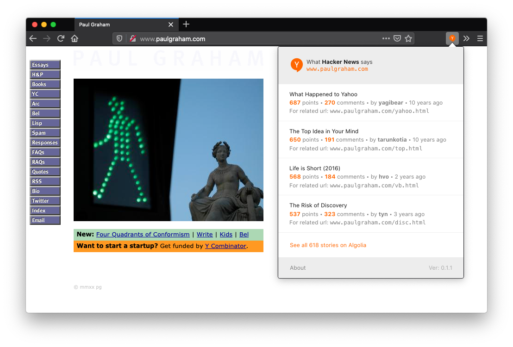

# What Hacker News says
Web Extension: Easly find Hacker News discussions about the page you're browsing.

## About
Dead-simple web extension that looks for threads on popular social news aggregator [Hacker News](https://news.ycombinator.com/news) via [HN Search API powered by Algolia](https://hn.algolia.com/api). I hacked this togheter in a few hours because I was unable to find something so simple: This web extension fetches the API only when the popup is clicked and does not run any background script. It also requires minimum permissions (just `activeTab` actually).

## Install
Get the extension for [Firefox](https://addons.mozilla.org/en-US/firefox/addon/what-hacker-news-says/) or [Chrome/Chromium](https://chrome.google.com/webstore/detail/what-hacker-news-says/khgegkjchclhgpglloficdmdannlpmoi) browsers.

You can also clone this repo and manually run it as an unpacked extension (but losing automatic future updates).

## Changelog
See [CHANGELOG.md](CHANGELOG.md).

## License
© Pino Ceniccola. MIT License.

